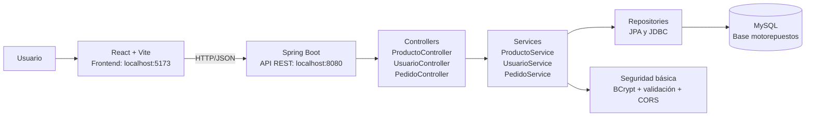

# Diagrama de arquitectura general

```mermaid
flowchart LR
    U[Usuario] --> R[React + Vite\nFrontend: localhost:5173]
    R -->|HTTP/JSON| C[Spring Boot\nAPI REST: localhost:8080]
    C --> CT[Controllers\nProductoController\nUsuarioController\nPedidoController]
    CT --> SV[Services\nProductoService\nUsuarioService\nPedidoService]
    SV --> RP[Repositories\nJPA y JDBC]
    RP --> DB[(MySQL\nBase motorepuestos)]
    SV --> SEC[Seguridad básica\nBCrypt + validación + CORS]
```

La arquitectura separa la presentación, la lógica de negocio, la persistencia y la base de datos.
