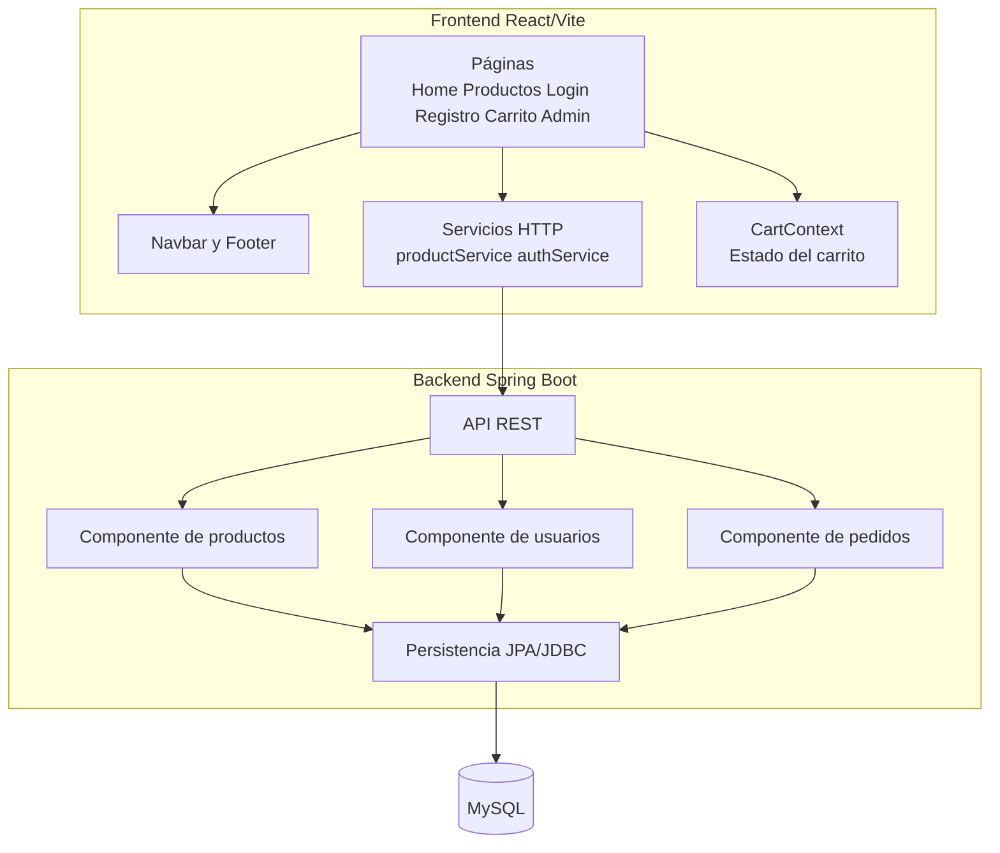

# Diagrama de componentes

```mermaid
flowchart TB
    subgraph Frontend[Frontend React/Vite]
        NAV[Navbar y Footer]
        PAGES[Páginas\nHome Productos Login Registro Carrito Admin]
        SERVICES[Servicios HTTP\nproductService authService]
        CONTEXT[CartContext\nEstado del carrito]
    end

    subgraph Backend[Backend Spring Boot]
        API[API REST]
        PRODUCTO[Componente de productos]
        USUARIO[Componente de usuarios]
        PEDIDO[Componente de pedidos]
        PERSISTENCIA[Persistencia JPA/JDBC]
    end

    DB[(MySQL)]
    PAGES --> NAV
    PAGES --> CONTEXT
    PAGES --> SERVICES
    SERVICES --> API
    API --> PRODUCTO
    API --> USUARIO
    API --> PEDIDO
    PRODUCTO --> PERSISTENCIA
    USUARIO --> PERSISTENCIA
    PEDIDO --> PERSISTENCIA
    PERSISTENCIA --> DB
```
