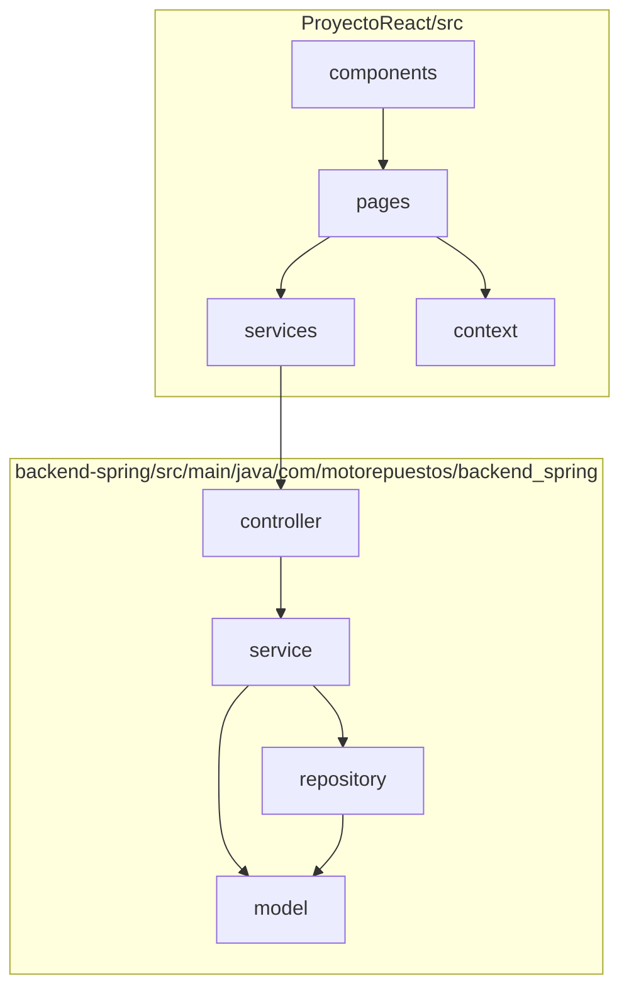

# Diagrama de paquetes

```mermaid
flowchart TB
    subgraph React[ProyectoReact/src]
        COMPONENTS[components]
        PAGES[pages]
        SERVICES[services]
        CONTEXT[context]
    end

    subgraph Java[backend-spring/src/main/java/com/motorepuestos/backend_spring]
        CONTROLLER[controller]
        MODEL[model]
        SERVICE[service]
        REPOSITORY[repository]
    end

    COMPONENTS --> PAGES
    PAGES --> SERVICES
    PAGES --> CONTEXT
    SERVICES --> CONTROLLER
    CONTROLLER --> SERVICE
    SERVICE --> MODEL
    SERVICE --> REPOSITORY
    REPOSITORY --> MODEL
```

Los paquetes se organizan por responsabilidad para facilitar mantenimiento, pruebas y reutilización.
